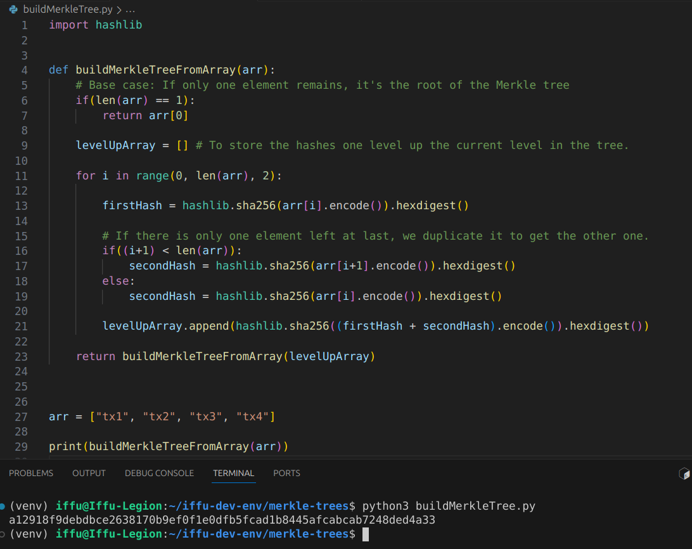
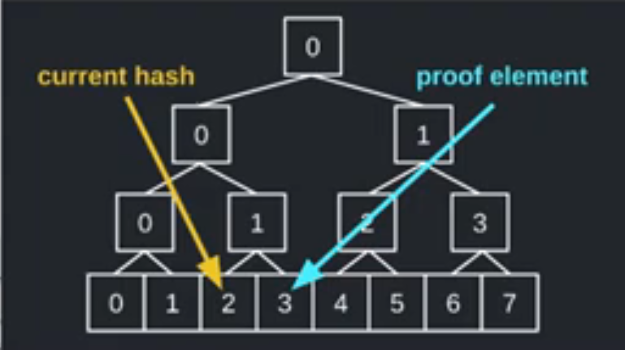

## Merkle Trees

This repository contains the necessary info needed to understand how a merkle tree works.

### Code
- buildMerkleTree.py -> This file has the code logic to build merkle tree from an array.
  
- verifyMerkleProof.sol -> This file has the code to verify if the leaf is present at an index along a path
    

### References to learn more about Merkle Trees

- https://www.youtube.com/watch?v=n6nEPaE7KZ8
- https://www.youtube.com/watch?v=qHMLy5JjbjQ
- https://www.youtube.com/watch?v=VkWiTvPnTcY